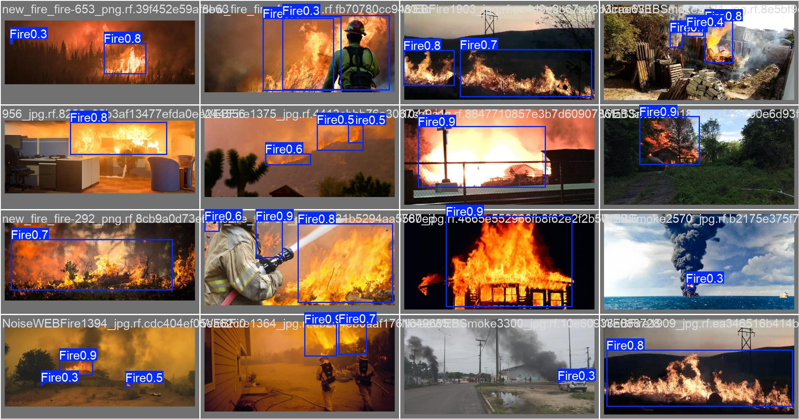
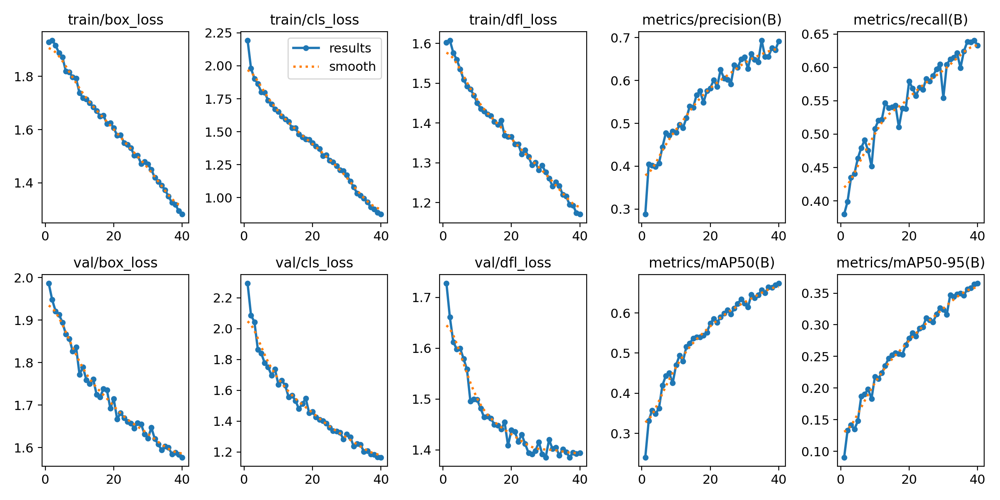

# 🔥 Real-Time Fire Detection with YOLOv8

[](https://github.com/ultralytics/ultralytics)
[](https://pytorch.org/)
[](https://www.python.org/)
[](https://opensource.org/licenses/MIT)

A production-grade, modular Python framework and demonstration suite for **Real-Time Fire Detection** using [Ultralytics YOLOv8](https://github.com/ultralytics/ultralytics). Designed for high-speed inference on edge devices, GPUs, and video streams.

---

## 🚀 Overview

Early fire detection is critical for preventing disasters in industrial plants, forests, and residential buildings. This repository provides a complete, well-structured deep learning pipeline powered by **YOLOv8s**, fine-tuned specifically to detect flames and fire outbreaks in diverse environments.

### Key Features
- **High Accuracy & Real-Time Speed**: Combines YOLOv8's state-of-the-art detector with CUDA GPU acceleration for rapid inference (~4ms per frame).
- **Modular Codebase**: Organized Python modules (`src/`) for clean separation of dataset validation, training, prediction, and evaluation.
- **CLI Tools**: Full command-line interface (`python -m src.train`, `python -m src.predict`, `python -m src.evaluate`).
- **Interactive Demos**: Ready-to-run Jupyter notebook (`notebooks/fire_detection_demo.ipynb`).
- **GitHub & Production Ready**: Configured with strict `.gitignore` to prevent repository bloating from large videos or datasets.

---

## 📊 Model Performance

After fine-tuning **YOLOv8s** for **40 epochs** on the Fire Detection dataset, the model achieved the following validation metrics:

| Metric | Value |
| :--- | :---: |
| **mAP@0.5** | `0.6740` |
| **mAP@0.5:0.95** | `0.3660` |
| **Precision** | `0.6910` |
| **Recall** | `0.6340` |
| **Inference Speed (RTX 4050)** | `4.1 ms/frame` |

---

## 🖼️ Sample Predictions & Training Results

### Real-Time Fire Detections
The model identifies active flames and smoke in real time with high confidence:



### Training Evaluation Curves
Validation curves demonstrate robust convergence across Precision, Recall, and mAP:



---

## 📂 Repository Structure

```text
fire-detection-yolov8/
├── configs/
│   ├── data.yaml                 # YOLOv8 dataset configuration file
│   └── default.yaml              # Default training and inference hyperparameters
├── examples/
│   ├── input/                    # Sample fire video and images for instant testing
│   └── output/                   # Sample annotated detection results and training curves
├── notebooks/
│   └── fire_detection_demo.ipynb # Interactive demo and exploration notebook
├── src/
│   ├── __init__.py               # Package initialization
│   ├── config.py                 # Centralized project paths and settings
│   ├── dataset.py                # Dataset stats, validation, and splitting utilities
│   ├── train.py                  # Modular training CLI script
│   ├── predict.py                # Video / Image / Webcam inference CLI script
│   ├── evaluate.py               # Validation and mAP metric evaluation CLI script
│   └── utils.py                  # PyTorch hardware checks and helpers
├── weights/
│   └── best.pt                   # Fine-tuned YOLOv8 fire detection model checkpoint
├── .gitignore                    # Safe gitignore (excludes heavy datasets & >100MB binaries)
├── pyproject.toml                # Modern Python project packaging metadata
├── requirements.txt              # Dependency specification
├── LICENSE                       # MIT License
└── README.md                     # Project documentation
```

---

## 🛠️ Installation & Setup

1. **Clone the Repository**:
   ```bash
   git clone https://github.com/Shivansh191005/fire-detection.git
   cd fire-detection
   ```

2. **Create a Virtual Environment (Optional but Recommended)**:
   ```bash
   python -m venv venv
   # Windows:
   .\venv\Scripts\activate
   # macOS/Linux:
   source venv/bin/activate
   ```

3. **Install Dependencies**:
   ```bash
   pip install -r requirements.txt
   ```

---

## ⚡ Quickstart Usage

### 1. Running Inference on Sample Input
We have included a sample fire video and images in `examples/input/` and the trained weights in `weights/best.pt` so you can test the model immediately:
```bash
python -m src.predict --source examples/input/sample_fire_video.mp4 --model weights/best.pt --conf 0.35
```
You can also run inference on the sample images:
```bash
python -m src.predict --source examples/input/sample_fire_1.jpg --model weights/best.pt --conf 0.35
```

### 2. Check Hardware & Dataset Statistics
Inspect your PyTorch CUDA GPU availability and dataset distribution:
```bash
python -m src.dataset
```

### 3. Training a Model from Scratch
Fine-tune a YOLOv8 model on your custom fire dataset:
```bash
python -m src.train --epochs 40 --batch 8 --imgsz 640 --device 0
```

### 4. Evaluating Model Metrics
Validate the trained weights against the validation set:
```bash
python -m src.evaluate --model weights/best.pt --split val
```

---

## 📓 Jupyter Notebook Demo

Explore the complete pipeline interactively using Jupyter Notebook or VS Code:
```bash
jupyter notebook notebooks/fire_detection_demo.ipynb
```

---

## 📜 License

This project is licensed under the **MIT License** - see the [LICENSE](LICENSE) file for details.
